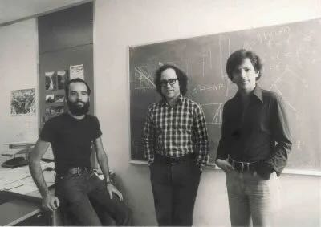

# Cryptosystème RSA

<h4>Introduction à la cryptographie et à la cryptanalyse</h4>

<h6>Rivest, Shamir et Adleman, les auteurs du cryptosystème</h6>

---

## Un peu de vocabulaire

- La **cryptologie** est la science du secret, elle englobe

  - La **cryptographie** est l'art de protéger l'information 

  - La **cryptanalyse** est l'analyse de la cryptographie

- Le **chiffrement** est la transformation qui, à l'aide d'une clé, rend un message incompréhensible sans l'aide d'une clé

- Un **cryptogramme** est un message chiffré

- Un **cryptosystème** est un algorithme de chiffrement

---

# Plan de l'exposé

- Rappels d'arithmétique
	* Algorithme d'Euclide étendu
	* Théorème des restes chinois
	* Théorème d'Euler-Fermat

- Cryptographie
	* Symmétrique
	* Asymmétrique
	* Clés RSA
  * Chiffrement RSA

- Cryptanalyse
	* Clés à facteurs communs
  * Factorisation de Fermat
	* Chosen ciphertext attack
	* Håstad's broadcast attack

---

## Algorithme d'Euclide étendu

Soit $a, b \in \mathbb{Z}$, *egcd* est un algorithme très efficace permettant de calculer 

$$(d, x, y) = egcd(a, b)$$

- d est le $\gcd(a, b)$, c'est-à-dire le plus grand entier divisant a et b
- x et y sont les coefficients de l'identité de Bézout $xa + yb = d$

La méthode est basée sur la division Euclidienne, c'est-à-dire, pour certains $q, r \in \mathbb{Z}$

$$a = qb + r \tag{avec r < b}$$

Sachant que $\gcd(a, b) = \gcd(b, r)$, on répète la division jusqu'à obtenir r = 0

Par exemple

$$
(1, 3, -2) = egcd(5, 7) \tag{car $3\times5-2\times7=1$}
$$

---

## Théorème des restes chinois

Soit $p, q \in \mathbb{Z}$ tels que $\gcd(p, q) = 1$ et notons $n = pq = 5 \times 7 = 35$

Alors avec $a, b \in \mathbb{Z}$ (prenons 1 et 2), on a $\exists! c \in \mathbb{Z}_n$ tel que

$$
\begin{align\*}
c \equiv a \pmod p & & c \equiv 1 \pmod 5 \\\\
c \equiv b \pmod q & & c \equiv 2 \pmod 7
\end{align\*}
$$

À l'aide de l'algorithme d'Euclide étendu, on trouve $x, y \in \mathbb{Z}$ les coefficients de Bézout

$$
\begin{align\*}
3 \times 5 -2 \times 7 = 1  \tag{$(1, 3, -2) = egcd(5, 7)$}
\end{align\*}
$$

Puis on construit la solution c comme suit

$$c \equiv ayq + bxp \pmod n$$

$$16 \equiv 1 \times (-2) \times 7 + 2 \times 3 \times 5 \pmod{35}$$

---

## Théorème d'Euler-Fermat

#### Petit théorème de Fermat

Soit $a, p \in \mathbb{Z}$ tels que p est premier, et $a \nmid p$, alors

$$a^{p-1} \equiv 1 \pmod p$$

#### Théorème d'Euler (Plus général)

Soit $a, n \in \mathbb{Z}$ tels que $\gcd(a, n) = 1$, alors

$$a^{\varphi(n)} \equiv 1 \pmod n$$

Où la fonction $\varphi$ est l'indicatrice d'Euler

$$
\begin{align\*}
\varphi : \mathbb{N}^\* & \to \mathbb{N}^\* \\\\
n &\mapsto \lvert \\{ m \leq n \mid gcd(m, n) = 1 \\} \rvert
\end{align\*}
$$

---

## Chiffrement symmétrique

- Alice et Bob doivent au préalable échanger en secret une clé

- Celle-ci permet de chiffrer et déchiffrer des messages

Sur l'alphabet $\mathbb{Z}_n$ on peut construire $n\varphi(n)$ fonctions de chiffrement affines

$$ 
\begin{align\*}
f_{ab} : \mathbb{Z}_n & \to \mathbb{Z}_n \tag{$a \in \mathbb{Z}_n^{\times}, b \in \mathbb{Z}_n$} \\\\
x &\mapsto ax + b \pmod n
\end{align\*}
$$

*Exemple*: la fonction $x \mapsto x + 3 \pmod{26}$ est appelée un code de César
 

`A B C D E F G H I J K L M N O P Q R S T U V W X Y Z` 
`D E F G H I J K L M N O P Q R S T U V W X Y Z A B C`

Plus généralement, sur un alphabet $\Sigma$ de cardinal n, on peut utiliser l'une des n! permutations $\sigma \in Sym(\Sigma)$ comme fonction de chiffrement

Ces méthodes, dites mono-alphabétiques, sont sujettes à l'analyse de fréquence

---

## Chiffrement asymmétrique

- Alice et Bob génèrent chacun une paire de clés
 * Une <green>clé publique</green>, qu'ils peuvent distribuer
 * Une <red>clé privée</red>, qu'ils gardent chacun pour eux

- Alice peut utiliser la <green>clé publique</green> de Bob pour lui chiffrer un message
 * Bob déchiffre le message avec sa <red>clé privée</red>

- Alice peut aussi utiliser sa <red>clé privée</red> pour signer un message
 * Bob vérifie la signature avec la <green>clé publique</green> de Alice

**RSA est un example de chiffrement asymmétrique**

L'avantage de ces systèmes est qu'ils ne nécéssitent pas d'échange préalable de secret

---

## Génération de clé RSA

1. On choisi deux grands nombres premiers p et q.
2. On calcule `n = pq` et $\varphi(n) = (p - 1)(q - 1)$ (par Théorème des restes chinois)
3. On choisi e tel que $gcd(e, \varphi(n)) = 1$ (Généralement 3 ou 65537)
4. On calcule d l'inverse modulo $\varphi(n)$ de e (tel que $ed \equiv 1 \pmod {\varphi(n)}$)
  * Si $(1, d, k) = egcd(e, \varphi(n))$, alors $de + k\varphi(n) = 1$

La <green>clé publique</green> est donc la paire <green>(n, e)</green> et la <red>clé privée</red> est simplement <red>d</red>

La sécurité des clés reposent sur la difficulté, sachant n, de retrouver les facteurs p et q

La paire (p, q) ou $\varphi(n)$ sont suffisant pour reconstruire <red>d</red> et compromettre le système

En effet, on peut construire un polynôme dont les racines sont p et q comme suit

$$
\begin{align\*}
\varphi(n) & = (p-1)(q-1) = pq - p - q + 1 \\\\
\implies p + q & = n - \varphi(n) + 1 \\\\
(x - p)(x - q) & = x^2 - (p + q)x + pq \\\\
&= x^2 - (n - \varphi(n) + 1)x + n
\end{align\*}
$$

---

## Chiffrement et déchiffrement RSA

Soit M un entier correspondant au message clair, on calcule le cryptogramme $C_M$

$$C_M \equiv M^e \pmod n$$

et le détenteur de la <red>clé privée</red> peut retrouver le message M comme suit
$$
\begin{align\*}
(C_M)^d & \equiv M^{ed} \pmod n \\\\
        & \equiv M^{1 + k\varphi(n)} \tag{$ed \equiv 1 \pmod{\varphi(n)}$}\\\\
        & \equiv M (M^{\varphi(n)})^k \\\\
        & \equiv M \tag{Thm Euler: $a^{\varphi(n)}\equiv1$}
\end{align\*}
$$

La sécurité d'un cryptogramme repose sur la difficulté de trouver sa racine e-ième modulo n

La sécurité de la clé privée, étant donné un message M et son cryptogramme C, repose sur la difficulté de calculer $d = log_C M$ (il s'agit du problème du logarithme discret)

---

## Cryptanalyse

RSA est un système complexe, ne pouvant être implémenté n'importe comment

On s'intéresse maintenant à des cas limites pouvant compromettre la sécurité de RSA

#### Clés à facteurs communs

#### Factorisation de Fermat

#### Chosen ciphertext attack

#### Håstad's broadcast attack

---

## Facteurs communs

Soient $p_1, p_2, q \in \mathbb{Z}$ premiers, notons

$$n_1 = p_1q = 391 \qquad n_2 = p_2q = 667$$

On peut trouver le facteur commun a l'aide de l'algorithme d'Euclide

$$q = \gcd(n_1, n_2) = \gcd(391, 667) = 23$$

Et retrouver les facteurs manquant de $n_1$ et $n_2$

$$p_1 = \frac{n_1}{q} = \frac{391}{23} = 17 \qquad p_2 = \frac{n_2}{q} = \frac{667}{23} = 29$$

---

## Chosen Ciphertext Attack

Soit $C_M \equiv M^e \pmod n$, M étant un message secret.

Supposons que l'on peut demander au détenteur de la clé privée de déchiffrer n'importe quel message autre que $C_M$

Prenons $a \in \mathbb{Z}_n^\times$ et $C_a \equiv a^e \pmod n$

On peut calculer $$C_aC_M \equiv a^e M^e \equiv (aM)^e \pmod n$$

On demande a l'oracle de dechiffrer $C_aC_M$

$$(C_aC_M)^d \equiv ((aM)^e)^d \equiv aM \pmod n$$

Ainsi on peut retrouver $M \equiv a^{-1}(C_aC_M)^d$

---

## Factorisation de Fermat

Soit n = 5959, on cherche $a, b \in \mathbb{N}$, tels que $n = a^2 - b^2$

Ces a, b existent, car si $n = cd$, on constate $n = \(\frac{c+d}{2}\)^2 - \(\frac{c-d}{2}\)^2 = ... = \frac{4cd}{4}$

Puisque $a^2 - b^2 = (a - b) \times (a + b)$, on a $a \pm b$ sont des facteurs de n

Pour $i = 0, 1, ...$ On calcule $a = \lceil\sqrt{n}\rceil + i,\; b^2 = a^2 - n,\; b = \sqrt{b^2}$

- Pour $i = 0$, on a $a = 78,\; b^2 = 125,\; b = 11.18$

- Pour $i = 1$, on a $a = 79,\; b^2 = 282,\; b = 16.79$

- Pour $i = 2$, on a $a = 80,\; b^2 = 441,\; b = 21$ (Un carré parfait)

On a donc 

$$ n = a^2 - b^2 = (a - b) \times (a + b) = (80 - 21) \times (80 + 21) = 59 \times 101 $$

---

## Håstad's broadcast attack

Soit un message M, chiffré pour 3 clés $n_1 = 55, n_2 = 391, n_3 = 1189$ avec $e = 3$

$$
C_1 = 47 \equiv M^3 \pmod {n_1} \newline
C_2 = 297 \equiv M^3 \pmod {n_2} \newline
C_3 = 252 \equiv M^3 \pmod {n_3}
$$

Par le théorème des restes chinois, on peut calculer $C \equiv M^3 \pmod {n_1n_2n_3}$

D'abord on obtient (1, 64, -9) = egcd(55, 391), puis (1, -531, 9604) = egcd(55*391, 1189)

Puis on calcule $C = 14887 \mod {25569445}$

Comme $M < n_i$, on a $M^3 < n_1n_2n_3$

Ainsi on peut retrouver $M = \sqrt[3]{C} = \sqrt[3]{14887} = 53$

---

## Conclusion

Bien que RSA soit considéré sécuritaire, on doit être vigilant lors de son implémentation

Autre attaques connues sur RSA:
- Fault attacks on CRT optimization
- Bleichenbacher's Adaptative Chosen Ciphertext Attack

En pratique, RSA est généralement utilisé
- pour échanger une clé de chiffrement symmétrique
- comme une partie d'un protocole de sécurité plus complexe

Autres cryptosystèmes asymétriques avec leurs avantages et inconvénient:
- L'échange de clé Diffie-Hellman
- DSA (basé sur les courbes elliptiques)

Informatique quantique, algorithme de Shor, Lattice-based cryptography...
